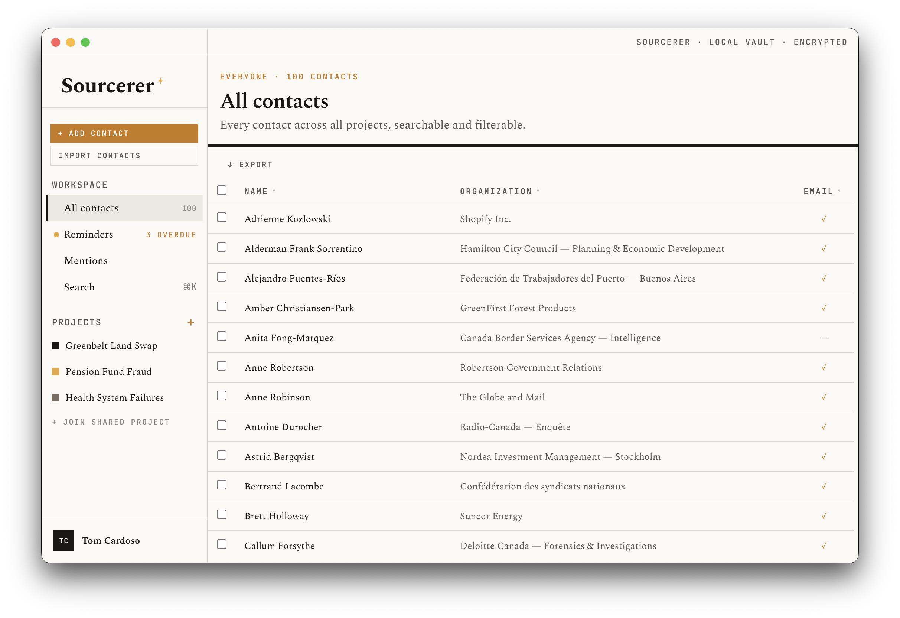

# Sourcerer

Source and contact management for investigative journalists — local-first, encrypted, no cloud.



---

## What it does

All data lives in an encrypted SQLite database on your own machine. There are no accounts, no sync servers, and no telemetry of any kind. The encryption key is derived from your master password with Argon2id on every unlock and is never written to disk.

Sourcerer is built around the workflow of investigative reporting: you manage a global contact book, then organise sources into projects with per-project status, priority, outreach history, and reporter attribution. You can log interactions, set reminders, and track exactly who owns each relationship and when it was last touched.

Deduplication surfaces likely-duplicate contacts via fuzzy name matching and exact email/phone signals, then presents them side-by-side so you can merge or dismiss each pair with one click.

A Chrome extension captures full-page screenshots from any browser tab and links them to a contact record. Screenshots are encrypted on disk with the same key as the database. Export to CSV, Excel, or vCard; import from CSV with semicolon-separated multi-value fields.

---

## Features

**Contacts**
- Add/edit name, organisation, notes, emails, phones, and links (LinkedIn, X, website, etc.)
- Staleness indicator flags contacts not touched in a configurable number of days
- Duplicate detection with one-click merge

**Projects**
- Local projects or shared (encrypted shared database on a shared drive)
- Per-project source memberships with reporter attribution, theme, priority, status, and outreach tracking
- Multiple reporters per project; conflict detection when the same contact is assigned to two reporters

**Outreach**
- Priority levels (Critical → Monitor-only) with configurable per-priority reminder intervals
- Status workflow: Not yet contacted → Contacted, no reply → In dialogue → Interview arranged → Interviewed (off/on-record) → Declined / Ghosted / Do not contact
- Interaction log per source per project
- Manual reminders with due dates and notes

**Alerts**
- RSS feed monitoring per contact; new mentions surfaced in a notification centre
- Optional Wayback Machine snapshot on link save

**Security**
- AES-256 encryption via SQLCipher; master password derived with Argon2id
- Auto-lock on idle (configurable timeout)
- Panic wipe: destroys the database and key material immediately
- Encrypted backup and restore

**Import / Export**
- CSV import with semicolon-separated multi-value fields (emails, phones, websites per cell)
- Export to CSV, Excel (.xlsx), or vCard (.vcf) — per project or all contacts
- Sanitised export mode strips notes and interaction logs for sharing

**Chrome extension**
- Full-page screenshot capture from any tab
- Contact picker links screenshots to a source record
- Screenshots stored encrypted alongside the database

---

## How it works

Sourcerer is an Electron + React + TypeScript application built with [electron-vite](https://electron-vite.org). The database is SQLite encrypted with [better-sqlite3-multiple-ciphers](https://github.com/m4heshd/better-sqlite3-multiple-ciphers) (SQLCipher AES-256-CBC). All communication between the renderer and the main process goes through a typed preload bridge — `nodeIntegration` is off, the renderer sandbox is on. The master password is never stored; the key is derived fresh on each unlock with Argon2id.

---

## Getting started

**Prerequisites:** Node 20+, npm

```bash
git clone https://github.com/your-org/sourcerer.git
cd sourcerer
npm install
npm run rebuild   # compiles native SQLite and Argon2 modules for Electron
npm run dev
```

> If you see a `NODE_MODULE_VERSION` mismatch error, run `npm run rebuild` again.

**Running tests** (before the Electron rebuild):

```bash
npm run rebuild:node   # compile native modules for system Node
npm test
npm run rebuild        # restore Electron-targeted binaries before npm run dev
```

---

## Security notes

- No network requests are made except: user-configured RSS feeds, optional Wayback Machine saves, and the local HTTP server that receives screenshots from the Chrome extension (localhost only, one-time token auth).
- The master password cannot be recovered. Use a passphrase — four random words are easier to remember and just as strong as a complex string.
- The Chrome extension communicates only with localhost and requires explicit one-time approval in the app.

---

## License

AGPL-3.0 — see [LICENSE](LICENSE).

## Tech stack

| Layer | Technology |
|---|---|
| Desktop framework | Electron (macOS 12+, Windows 10/11) |
| UI | React + TypeScript (electron-vite) |
| Database | SQLite via `better-sqlite3-multiple-ciphers` (SQLCipher) |
| Key derivation | Argon2id (m=65536, t=3, p=1, 32-byte key) |
| Build / package | electron-vite + electron-builder |

---

## Setup

Native modules (SQLCipher, Argon2) must be compiled against Electron's Node.js runtime, not the system Node. Run these once after cloning:

```bash
npm install --ignore-scripts
node node_modules/electron/install.js
./node_modules/.bin/electron-rebuild -f -w better-sqlite3-multiple-ciphers,argon2
```

> **After any `npm install` that touches native modules**, re-run the `electron-rebuild` line above.

### Prerequisites

- Node.js 20+
- macOS: Xcode Command Line Tools (`xcode-select --install`)
- Python 3 (required by native module build tooling)

---

## Development

```bash
npm run dev
```

Launches the app with hot-reload. On first launch you'll be prompted to create a name, email, and master password. This derives the encryption key and initialises the local database.

In dev mode, a set of realistic seed contacts and projects is loaded automatically on first unlock so you have something to work with immediately.

```bash
npm run typecheck   # type-check without building
npm run build       # compile only
npm run package     # compile + create distributable
```

---

## Data storage

All data lives locally in Electron's `userData` directory (typically `~/Library/Application Support/sourcerer` on macOS):

| File | Purpose |
|---|---|
| `sourcerer.db` | SQLCipher-encrypted SQLite database |
| `sourcerer.salt` | Argon2id salt — not secret, but must not be deleted |

**The master password is never stored.** Losing it means permanent loss of access to the database — there is no recovery mechanism.

---

## Local HTTP server

When the app is running, a local server listens on `127.0.0.1:27371`. This powers:

- **Browser extension API** — session-token-protected endpoints for reading contacts and logging interactions. The extension must request access; the app shows an approval prompt before issuing a token.
- **iCal feed** — `GET /calendar/reminders.ics?token=<calendar_token>` returns a VCALENDAR of upcoming reminders. The calendar token is persistent (survives restarts) and can be regenerated from Settings.

The server only binds to loopback — it is not accessible from the network.

---

## Collaboration

Sourcerer supports optional file-based collaboration: point two installs at the same SQLCipher file in a shared folder (Dropbox, OneDrive) and they sync automatically every two minutes. Sync is last-write-wins on `updated_at` timestamps. The message scratchpad is never synced.
