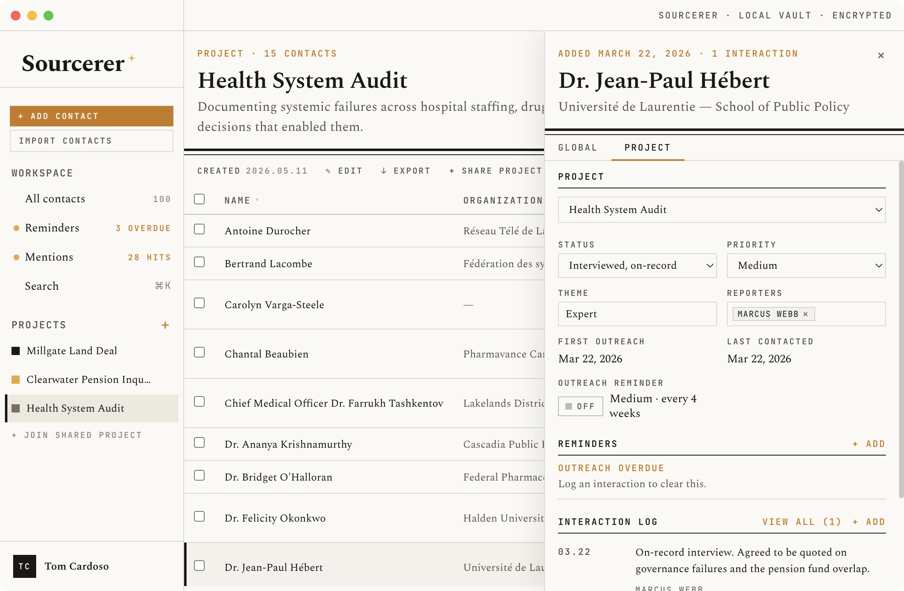

# Sourcerer

Source and contact management for journalists and researchers — local-first, encrypted, no cloud.

[](https://github.com/tomcardoso/sourcerer/releases/latest)
[](https://github.com/tomcardoso/sourcerer/actions/workflows/ci.yml)
[](LICENSE)
[](https://github.com/sponsors/tomcardoso)



_All names and details in the screenshot are fictional and generated for demonstration purposes only._

---

- [What it does](#what-it-does)
- [Features](#features)
- [How it works](#how-it-works)
- [Installation](#installation)
- [Getting started (development)](#getting-started-development)
- [Security notes](#security-notes)
- [License](#license)

---

## What it does

All data lives in an encrypted SQLite database on your own machine. There are no accounts, no sync servers, and no telemetry of any kind. The encryption key is derived from your master password with Argon2id on every unlock and is never written to disk.

Sourcerer is built around the workflow of investigative reporting: you manage a global contact book, then organise sources into projects with per-project status, priority, outreach history, and reporter attribution. You can log interactions, set reminders, and track exactly who owns each relationship and when it was last touched.

Deduplication surfaces likely-duplicate contacts via fuzzy name matching and exact email/phone signals, then presents them side-by-side so you can merge or dismiss each pair with one click.

A browser extension (Chrome and Firefox) captures full-page screenshots from any browser tab and links them to a contact record. Screenshots are encrypted on disk with the same key as the database. Export to CSV, Excel, or vCard; import from CSV or vCard (.vcf).

---

## Features

**Contacts**
- Add/edit name, organisation, notes, emails, phones, and links (LinkedIn, X, website, etc.)
- Staleness indicator flags contacts not touched in a configurable number of days
- Duplicate detection with one-click merge

**Projects**
- Local projects or shared (encrypted shared database on a shared drive)
- Per-project source memberships with reporter attribution, theme, priority, status, and outreach tracking
- Multiple reporters per project; conflict detection when the same contact is assigned to two reporters
- Timeline view: reverse-chronological interaction log across an entire project or all contacts, filterable by priority, theme, org, reporter, and date range

**Outreach**
- Priority levels: Critical, High, Medium, Low, Monitor-only — each with a fixed reminder interval
- Status workflow: Not yet contacted → Contacted, no reply → In dialogue → Interview arranged → Interviewed (off/on-record) → Declined / Declined, door open / Referred to comms / Ghosted / Do not contact
- Interaction log per source per project
- Automatic reminder notifications per priority level; manual reminders with due dates and notes

**Alerts**
- RSS feed monitoring per contact; new mentions surfaced in a notification centre
- Optional Wayback Machine snapshot on link save (requires free Archive.org S3 API keys)

**Security**
- AES-256 encryption via SQLCipher; master password derived with Argon2id
- Portable vault: a self-contained `.sourcerer` bundle (database, key file, screenshots) that you can store anywhere — local drive, external drive, or cloud-synced folder
- Auto-lock on idle (configurable timeout)
- Redaction mode (Ctrl+Shift+R) blurs all contact details, names, and notes on screen
- Panic wipe: destroys the database and key material immediately
- Encrypted backup and restore; configurable auto-backup

**Import / Export**
- CSV import with semicolon-separated multi-value fields (emails, phones, websites per cell)
- vCard (.vcf) import — single or multi-contact files; handles Apple/Google exports
- Export to CSV, Excel (.xlsx), or vCard (.vcf) — per project or all contacts
- Sanitised export mode strips notes and interaction logs for sharing

**[Chrome extension](https://chromewebstore.google.com/detail/sourcerer/pipgdnekoknjbghnmhilapocpchdcadm)** · **[Firefox extension](https://addons.mozilla.org/en-CA/firefox/addon/sourcerer-for-journalists/)**
- Full-page screenshot capture from any tab
- Contact picker links screenshots to a source record
- Screenshots stored encrypted alongside the database

---

## How it works

Sourcerer is an Electron + React + TypeScript application built with [electron-vite](https://electron-vite.org). The database is SQLite encrypted with [better-sqlite3-multiple-ciphers](https://github.com/m4heshd/better-sqlite3-multiple-ciphers) (SQLCipher AES-256-CBC). All communication between the renderer and the main process goes through a typed preload bridge — `nodeIntegration` is off, the renderer sandbox is on. The master password is never stored; the key is derived fresh on each unlock with Argon2id.

All data lives in a self-contained `.sourcerer` vault bundle — a directory containing the encrypted database, the Argon2 salt file, and any screenshots captured by the browser extension. The vault can be placed anywhere: a local folder, an external drive, or a cloud-synced folder. On macOS, Finder presents the bundle as a single opaque file.

### Shared projects and their consistency model

Collaboration works by putting a second SQLCipher database in a cloud-synced folder. There is no server, and no third party ever holds a key — which is the point, but it bounds what sync can guarantee.

Shared projects are **eventually consistent, provided collaborators don't write within the same cloud-sync upload window.** Cloud providers replicate whole files and fork on concurrent writes; they never merge. Two simultaneous saves produce a provider-level "conflicted copy" next to the real file, and the losing side's changes are not in the file Sourcerer goes on to read.

Conflicts that do get reconciled resolve last-write-wins by wall-clock timestamp at second granularity. Those clocks belong to the collaborators' machines and nothing arbitrates between them, so a badly skewed clock can resolve a conflict backwards.

This is a limitation of the substrate, not of the merge logic, and it is permanent for as long as the design stays serverless. In practice: work a few minutes apart, and don't treat a shared project as the only copy of something you can't lose.

---

## Installation

Pre-built binaries for **macOS (Apple Silicon)**, **Windows (x64)**, and **Linux (x64)** are published with each release.

**[→ Download the latest release](https://github.com/tomcardoso/sourcerer/releases/latest)**

**macOS**

1. Download `Sourcerer-<version>-arm64.dmg`.
2. Open the `.dmg` and drag Sourcerer to your Applications folder.
3. On first launch, macOS may prompt you to confirm you want to open the app. Click **Open**.

**Windows**

1. Download `Sourcerer Setup <version>.exe`.
2. Run the installer. Sourcerer will be installed to your user profile and a Start Menu shortcut will be created.

**Linux**

1. Download `Sourcerer-<version>.AppImage`.
2. Make it executable: `chmod +x Sourcerer-*.AppImage`
3. Run it: `./Sourcerer-*.AppImage`

No installation required. The AppImage runs on any x64 Linux distribution with glibc 2.17+ (Ubuntu 18.04+, Fedora 27+, Debian 9+, and equivalents).

---

## Getting started (development)

**Prerequisites:** Node 20+, npm

```bash
git clone https://github.com/tomcardoso/sourcerer.git
cd sourcerer
npm install
npm run rebuild   # compiles native SQLite and Argon2 modules for Electron
npm run dev
```

> If you see a `NODE_MODULE_VERSION` mismatch error, run `npm run rebuild` again.

**Running tests** (before the Electron rebuild):

```bash
npm run rebuild:node   # compile native modules for system Node
npm test
npm run rebuild        # restore Electron-targeted binaries before npm run dev
```

**Inspecting the database** (TablePlus, DB Browser, sqlite3, etc.):

```bash
npm run rebuild:node   # only needed once, or after switching between dev and Electron
npm run db:export      # prompts for your app password, writes sourcerer-plain.db
```

The exported file is a standard unencrypted SQLite database. Delete it when you're done — it contains all your source data in plaintext. (`*.db` is in `.gitignore` so it won't be committed accidentally.)

---

## Security notes

- No network requests are made except: user-configured RSS feeds, optional Wayback Machine saves (requires Archive.org S3 API keys configured in Settings), and the local HTTP server that receives screenshots from the browser extension (localhost only, one-time token auth).
- The master password cannot be recovered. Use a passphrase — four random words are easier to remember and just as strong as a complex string.
- The browser extension communicates only with localhost and requires explicit one-time approval in the app.
- **Sourcerer has not yet had an independent third-party security audit.** The encryption relies on standard, well-reviewed primitives (SQLCipher, Argon2id) rather than anything custom, and the source is open for inspection — but no external reviewer has examined the implementation. An external review has been applied for. See [security.html](https://tomcardoso.github.io/sourcerer/security.html) for the full picture.

---

## License

AGPL-3.0 — see [LICENSE](LICENSE).
